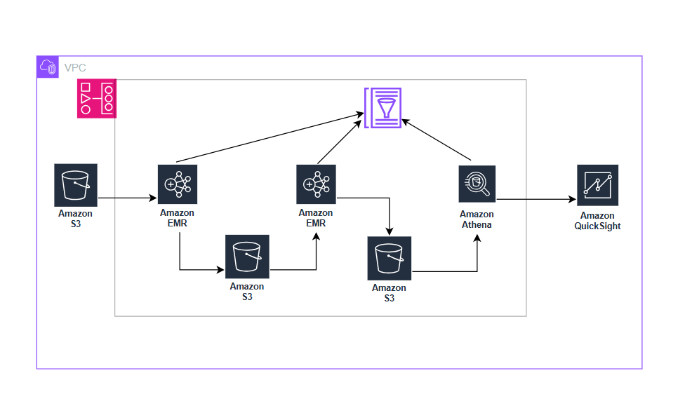

# branchpulse

## Objective:
The core objective of this project is to enable business stakeholders of the bank to make data driven decisions by providing them with summary details of brach level performance and merchant spend analytics.

The services used here are - S3, EMR Serverless, Athena, PySpark, Airflow, Glue Catalog, Iceberg

## Architecture
